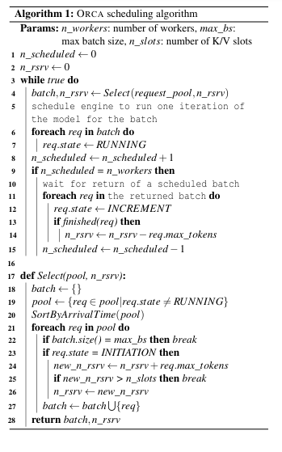

RequestDescriptor: immutable metadata + mutable fields (state, generated_tokens, kv_slot_range).
RequestPool: priority structure (arrival order queue + lookup map) supporting concurrent inserts/removals.
KVSlotManager: tracks n_slots, reservations, frees on completion.
BatchBuilder: encapsulates Algorithm 1 Select logic so you can unit test it with synthetic pools.
EngineClient: async interface (gRPC, IPC) that can keep up to n_workers batches in flight and hands completions back via callbacks.

Endpoint thread enqueues descriptors into RequestPool.
Scheduler loop:
Ask BatchBuilder for next batch (blocks if none eligible or KV slots exhausted).
Dispatch single-iteration work order via EngineClient.
Track outstanding batches; when n_scheduled == n_workers, await earliest completion to free capacity.
Completion handler:
Update descriptors (generated_tokens += 1, state → INCREMENT).
If finished, free KV slots and signal endpoint to stream response chunk / finalize.